# Brainstorming Ideas Into Designs

## Overview

Help turn ideas into fully formed designs and specs through natural collaborative dialogue.

Start by understanding the current project context, then ask questions one at a time to refine the idea. Once you understand what you're building, present the design and get user approval.

<HARD-GATE>
Do NOT invoke any implementation skill, write any code, scaffold any project, or take any implementation action until you have presented a design and the user has approved it. This applies to EVERY project regardless of perceived simplicity.
</HARD-GATE>

## Context Gate

Before starting, check context utilization:

```bash
context_pct=$(bash "$(dirname "$CLAUDE_SKILL_DIR")/../scripts/context-check" 2>/dev/null) || true
```

- If the script errors, warn the user: "Context awareness unavailable — `.claude/.statusline-stats` not found."
- If `context_pct` is above **20%**, recommend:
  > Context is at N%. For best results, start fresh: `/clear`

## Anti-Pattern: "This Is Too Simple To Need A Design"

Every project goes through this process. A todo list, a single-function utility, a config change — all of them. "Simple" projects are where unexamined assumptions cause the most wasted work. The design can be short (a few sentences for truly simple projects), but you MUST present it and get approval.

## Pre-flight Checks

Before exploring the project, verify the CONTRIBUTING.md workflow prerequisites. Both checks are **soft gates** — the user can always proceed anyway.

### 1a. Issue Check

The user's initial message or `/brainstorming` arguments describe the work. Use this to determine or create the issue automatically — do not prompt the user for an issue number unless the description is too vague to search.

**Determine the issue type** from context — use `feature`, `bug`, or `epic` for `bd create --type=`. Map to GitHub labels: `feature`→`enhancement`, `bug`→`bug`, `epic`→`epic`. If the label doesn't exist on the repo, create it first with `gh label create "<label>" --description "<type> work"`.

**Resolve the issue** (pick the first matching branch):

- **Existing issue number or URL provided:** Run `gh issue view <number> --json title,state` to verify it exists. Capture the title. If the issue is **closed**, warn: "Issue #N is closed. Continue with this issue, pick a different one, or proceed without?" Handle accordingly.
- **Description provided (no issue number):** Run `gh issue list --search "<keywords>" --state open --json number,title --limit 5` to check for duplicates. If matches found, tell the user: "Found existing issue #N '<title>' which looks related — using that." If multiple matches, pick the best one and mention the others. If no matches, tell the user: "No existing issues match — creating issue." Run `gh issue create --title "<summary>" --body "<one-paragraph description of the work>" --label "<gh-label>"`.
- **Description too vague to search:** Ask: "Can you give me a one-line summary of what you're working on?"
- **User wants exploratory/no-issue work:** Route to `ideate` skill instead — ideation is the right tool for divergent exploration without a concrete issue. If the user returns with a specific direction, resume from the bullet above.

**After issue is resolved:**

1. **Create beads issue:** Run `bd create --title="<summary>" --type=<type> --description="<one-paragraph description>" --external-ref=gh-<N> --json`. Always include `--description` to provide context. If `bd` is unavailable or fails, proceed without beads tracking — the GitHub issue alone is sufficient.
2. **Record both:** Capture the GH issue number and beads ID (the `id` field from the `--json` response, e.g., `{"id": "beads-NNN", ...}`) for the design doc header.

### 1b. Branch Check

Run `git branch --show-current` to detect the current branch.

- **If on `main` or `master`:** Notify: "You're on `<branch>` — creating a worktree." Invoke using-git-worktrees automatically. If worktree creation fails, warn and allow proceeding on main.
- **If on any other branch:** Proceed to Step 2.

## Work Tracking

Follow the work-tracking protocol in SPEC.md (INV-14).

## Checklist

You MUST create a task for each of these items and complete them in order:

1. **Pre-flight checks** — verify issue exists and on feature branch (soft gates, see Pre-flight Checks section)
2. **Explore project context** — check files, docs, recent commits
3. **Ask clarifying questions** — one at a time, understand purpose/constraints/success criteria
4. **Propose 2-3 approaches** — with trade-offs and your recommendation
5. **Consider subsystem boundaries** — does this fit in one subsystem or cross boundaries? If it crosses, note which SPEC.md files are relevant and flag that the plan should be split by subsystem. If a new subsystem boundary is identified that lacks a SPEC.md, recommend `/codify-subsystem` after implementation
6. **Present design** — in sections scaled to their complexity, get user approval after each section
7. **Evaluate epic scope** — does this design represent multiple distinct issues? If yes, restructure as epic with child issues (soft gate, see Evaluate Epic Scope section)
8. **Identify documentation impact** — invoke documentation-standards (draft mode) to draft updates to tracked project docs
9. **Write design doc** — save to `docs/plans/YYYY-MM-DD-<topic>-design.md` (local working directory, not committed), include documentation updates section
10. **Evaluate UX design need** — if user-facing or agentic, recommend ux-design-agent
11. **Transition to implementation** — invoke writing-plans skill to create implementation plan

## Process Flow

```dot
digraph brainstorming {
    // Pre-flight: issue check (auto-create)
    "Pre-flight checks" [shape=box];
    "Issue number given?" [shape=diamond];
    "Verify issue exists" [shape=box];
    "Search for duplicates" [shape=box];
    "Duplicate found?" [shape=diamond];
    "Use existing issue" [shape=box];
    "Create new issue" [shape=box];
    "Pre-flight checks" -> "Issue number given?";
    "Issue number given?" -> "Verify issue exists" [label="yes"];
    "Issue number given?" -> "Search for duplicates" [label="no, description given"];
    "Issue number given?" -> "Route to ideate" [label="exploratory / no issue"];
    "Route to ideate" [shape=doublecircle];
    "Verify issue exists" -> "On feature branch?";
    "Search for duplicates" -> "Duplicate found?";
    "Duplicate found?" -> "Use existing issue" [label="yes"];
    "Duplicate found?" -> "Create new issue" [label="no"];
    "Use existing issue" -> "On feature branch?";
    "Create new issue" -> "On feature branch?";

    // Pre-flight: branch check
    "On feature branch?" [shape=diamond];
    "Auto-create worktree" [shape=box];
    "On feature branch?" -> "Explore project context" [label="yes"];
    "On feature branch?" -> "Auto-create worktree" [label="no"];
    "Auto-create worktree" -> "Explore project context";

    // Discovery and design
    "Explore project context" [shape=box];
    "Prior ideation exists?" [shape=diamond];
    "Read idea files" [shape=box];
    "Ask clarifying questions" [shape=box];
    "Propose 2-3 approaches" [shape=box];
    "Consider subsystem boundaries" [shape=box];
    "Present design sections" [shape=box];
    "User approves design?" [shape=diamond];
    "Explore project context" -> "Prior ideation exists?";
    "Prior ideation exists?" -> "Read idea files" [label="yes"];
    "Prior ideation exists?" -> "Ask clarifying questions" [label="no"];
    "Read idea files" -> "Ask clarifying questions";
    "Ask clarifying questions" -> "Propose 2-3 approaches";
    "Propose 2-3 approaches" -> "Consider subsystem boundaries";
    "Consider subsystem boundaries" -> "Present design sections";
    "Present design sections" -> "User approves design?";
    "User approves design?" -> "Present design sections" [label="no, revise"];

    // Finalization
    "Evaluate epic scope" [shape=diamond];
    "Restructure as epic" [shape=box];
    "Draft doc updates" [shape=box];
    "Write design doc" [shape=box];
    "UX design needed?" [shape=diamond];
    "Invoke ux-design-agent" [shape=box];
    "Invoke writing-plans skill" [shape=doublecircle];
    "User approves design?" -> "Evaluate epic scope" [label="yes"];
    "Evaluate epic scope" -> "Restructure as epic" [label="yes, split"];
    "Evaluate epic scope" -> "Draft doc updates" [label="no, single issue"];
    "Restructure as epic" -> "Draft doc updates";
    "Draft doc updates" -> "Write design doc";
    "Write design doc" -> "UX design needed?";
    "UX design needed?" -> "Invoke ux-design-agent" [label="yes"];
    "UX design needed?" -> "Invoke writing-plans skill" [label="no"];
    "Invoke ux-design-agent" -> "Invoke writing-plans skill";
}
```



**The terminal state is invoking writing-plans.** The only intermediate skills you may invoke are using-git-worktrees (during pre-flight, if on main), documentation-standards (after design approval), and ux-design-agent (when UX design is needed). Do NOT invoke any other implementation skill.

## The Process

**Prior ideation:**
- If user references an idea file (`docs/*-idea-*.md`) or mentions prior ideation, read it
- Follow any `Related: [[...]]` links to gather context from connected ideas
- Use this context to skip or shorten discovery — the problem/opportunity is already captured

**Understanding the idea:**
- Check out the current project state first (files, docs, recent commits)
- If prior ideation exists, start from that context
- Ask questions one at a time to refine the idea
- Prefer multiple choice questions when possible, but open-ended is fine too
- Only one question per message - if a topic needs more exploration, break it into multiple questions
- Focus on understanding: purpose, constraints, success criteria

**Exploring approaches:**
- Propose 2-3 different approaches with trade-offs
- Present options conversationally with your recommendation and reasoning
- Lead with your recommended option and explain why

**Presenting the design:**
- Once you believe you understand what you're building, present the design
- Scale each section to its complexity: a few sentences if straightforward, up to 200-300 words if nuanced
- Ask after each section whether it looks right so far
- Cover: architecture, components, data flow, error handling, testing
- Be ready to go back and clarify if something doesn't make sense

## Evaluate Epic Scope

After the user approves the design, evaluate whether it represents multiple distinct issues that should be structured as an epic. This is a **soft gate** — recommend restructuring but let the user proceed if they disagree.

**Ask:**

> Does this design represent multiple distinct issues/features that should be an epic?

**Signs the work should be an epic:**
- The design has 2+ independently deliverable features
- Different parts could be reviewed and merged separately
- The work would produce a PR touching unrelated subsystems for unrelated reasons
- The issue title uses "and" to join distinct goals

**If yes — restructure:**
1. Add the `epic` label to the current issue: `gh issue edit <N> --add-label epic`
2. Create child issues for each distinct unit of work: `gh issue create --title "<child summary>" --body "Part of #<N>" --label enhancement`
3. Update beads issue type if available: `bd update <id> --type=epic`
4. Each child issue maps 1:1 to a future PR
5. Continue with the design doc, noting the epic structure and child issues

**If no:** Proceed to documentation impact.

## Evaluating UX Design Need

UX design is always required unless both:
- User experience (including with agents) is unaffected
- Agent interaction patterns — how agents ask questions, present options, handle approval, escalate, or delegate — are unaffected

**DO NOT** make exceptions because changes are viewed as "internal" or "infrastructure".

**Ask explicitly:**
> "This affects [user experience / agent interaction patterns / both / neither].
> I recommend UX design — proceed, or skip to implementation planning?"

When UX design is required, use **ux-design-agent** (REQUIRED SUB-SKILL) to produce structured requirements, then continue to writing-plans. Otherwise, proceed directly to writing-plans.

## After the Design

**Documentation impact:**
- After user approves the design, invoke documentation-standards in draft mode
- The skill reads existing tracked docs (`README.md`, `docs/ARCHITECTURE.md`, `docs/DESIGN.md`, relevant `SPEC.md` files)
- It drafts updates for any docs that need to reflect the design's decisions
- User approves, modifies, or defers each drafted update
- Approved drafts are included in the design doc under a "Documentation Updates" section

**Writing the design doc:**
- Write the validated design to `docs/plans/YYYY-MM-DD-<topic>-design.md` (local working directory, not committed)
- Include this header at the top of the design doc:
  ```markdown
  # Design: <topic>

  **Issue:** #<number> — <title>
  **Beads:** <beads-id>
  **Date:** YYYY-MM-DD
  **Branch:** <branch-name>
  ```
  If the issue check was skipped, use `**Issue:** None (exploratory)`.
  Get the branch name from `git branch --show-current`.
- Include the "Documentation Updates" section from the documentation-standards draft
- Use writing-clearly-and-concisely skill if available
- Paste the design into the PR body when you open it

**Implementation:**
- If no worktree was created during pre-flight, use using-git-worktrees to create one
- Invoke writing-plans to create detailed implementation plan

## Key Principles

- **One question at a time** - Don't overwhelm with multiple questions
- **Multiple choice preferred** - Easier to answer than open-ended when possible
- **YAGNI ruthlessly** - Remove unnecessary features from all designs
- **Explore alternatives** - Always propose 2-3 approaches before settling
- **Incremental validation** - Present design in sections, validate each
- **Be flexible** - Go back and clarify when something doesn't make sense

## Integration

**Invokes:**
- **using-git-worktrees** — During pre-flight checks, if on `main`/`master` (auto-created)
- **documentation-standards** — Draft mode, after design approval, before writing design doc

**Called by:**
- Directly via `/brainstorming`
- Any task creating features, building components, adding functionality, or modifying behavior (per skill trigger)

**Pairs with:**
- **writing-plans** — Terminal state; brainstorming always transitions to planning
- **ux-design-agent** — Optional intermediate step for user-facing or agentic designs
