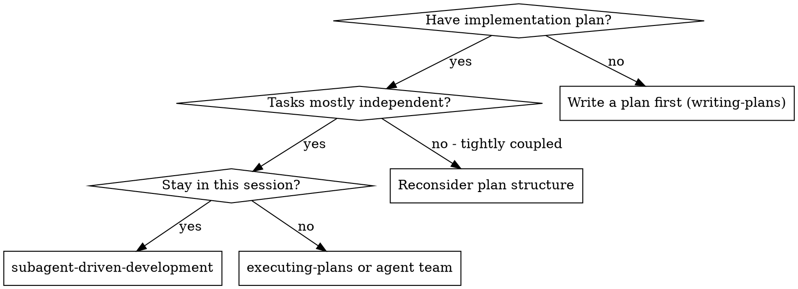
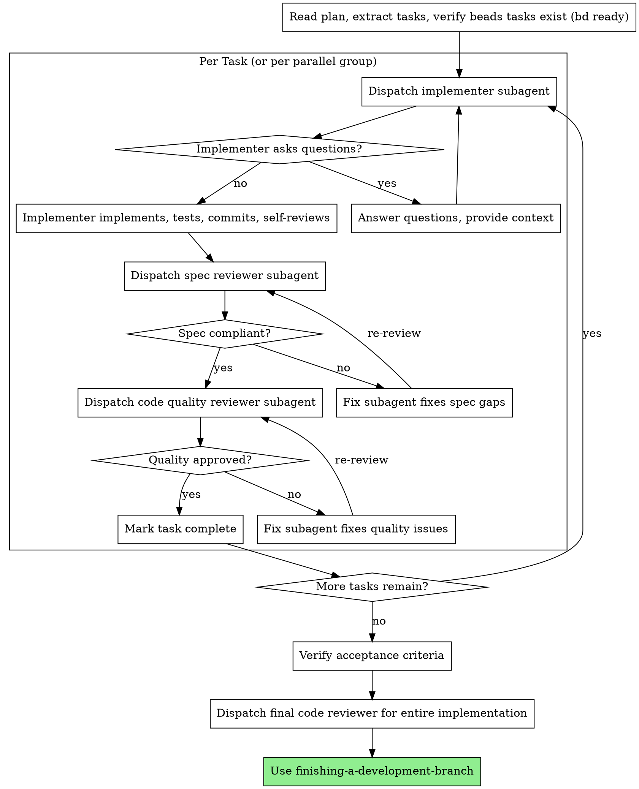

# Subagent-Driven Development

Execute plan by dispatching fresh subagents per task, with two-stage review after each: spec compliance first, then code quality. Independent tasks can run in parallel.

**Core principle:** Fresh subagent per task + two-stage review (spec then quality) = high quality at scale. Independent tasks parallelize; dependent tasks wait.

## Context Gate

Before starting, check context utilization:

```bash
context_pct=$(bash "$(dirname "$CLAUDE_SKILL_DIR")/../scripts/context-check" 2>/dev/null) || true
```

- If the script errors, warn the user: "Context awareness unavailable — `.claude/.statusline-stats` not found."
- If `context_pct` is above **40%**, recommend compaction with a directed preservation prompt:
  > Context is at N%. Recommend compacting before execution. You'll keep the plan and issue context; design and planning dialogue will be summarized.
  >
  > Run: `/compact Preserve: implementation plan at <path>, issue #N, branch <name>, beads task IDs. Summarize all prior discussion.`
- You may recommend compaction at lower percentages if remaining work is substantial (e.g., 5+ plan tasks, multiple subsystem specs to load), but not below **30%**.

## Work Tracking

Follow the work-tracking protocol in SPEC.md (INV-14). Skill-specific additions:

- Display pipeline status after each task batch: `bd list --type=task --json | bd-pipeline --phase executing --next finishing`

**Fallback note:** Plan file is the source of truth.

## When to Use



**If tasks are tightly coupled** (shared files, shared state, ordering dependencies beyond explicit `Depends on:`), break them into smaller independent units or execute them serially within a single subagent.

## Worktree Guard

**Before starting, verify you are NOT on main/master:**

```bash
branch=$(git branch --show-current)
if [ "$branch" = "main" ] || [ "$branch" = "master" ]; then
  echo "ERROR: On $branch — must be in a worktree/feature branch."
  echo "Run /using-git-worktrees first."
  exit 1
fi
echo "Verified: on branch $branch in $(pwd)"
```

**If CWD is invalid** (e.g., worktree was removed): Navigate back to the project root or worktree path before proceeding. Run `git worktree list` to find valid worktree paths.

**Worktree auto-detection:** Run `git rev-parse --show-toplevel` and compare with `git worktree list` to determine if you're in a worktree. If the toplevel path appears as a worktree entry (not the main working tree), confirm you're operating in the correct worktree for the plan's issue. Cross-reference the `.issue` file if present. Re-verify worktree path before each subagent dispatch — subagents inherit the working directory but should confirm it.

**Re-verify CWD before each task dispatch** — agents can lose track of their working directory between tasks.

## The Process



### Step by step

1. **Read plan.** Extract all tasks with full text. Run `bd ready --json` to verify beads tasks exist. If not, run `bd create -f <plan-file>` to create them. If `bd` is unavailable, proceed without beads tracking. Use `bd ready` to identify unblocked tasks for dispatch.
2. **Check task sizing.** Each task should fit ~50% of a subagent's context window. If a task looks too large, break it up before dispatching.
3. **Load subsystem context.** For each task, find the nearest SPEC.md to the task's target files. If one exists, prepend its key sections (Purpose, Invariants, Failure Modes) to the task context when dispatching. For cross-cutting tasks: include the full spec for the primary subsystem and only the Public Interface section from adjacent subsystems. If a task needs >2 specs, it crosses too many boundaries — split it before dispatching.
4. **Dispatch task.** Fresh subagent (via Task tool) with full task text and context. For independent tasks, dispatch in parallel. For dependent tasks, wait.
5. **Handle questions.** If the subagent asks questions, answer clearly before letting them proceed.
6. **Spec review.** Dispatch spec compliance reviewer (./spec-reviewer-prompt.md). If issues found, dispatch fix subagent, then re-review.
7. **Quality review.** Dispatch code quality reviewer (./code-quality-reviewer-prompt.md). If issues found, dispatch fix subagent, then re-review.
8. **Document review.** After both reviews pass, document the findings:
   - **Beads:** `bd update <task-id> --notes "Review: PASS — spec ✅, quality ✅, N findings resolved"`
   - **GitHub issue:** Post a summary using the collapsible format:
     ```bash
     gh issue comment <N> --body "$(cat <<'REVIEW_EOF'
     ## Spec Review — Task N
     <details><summary>Verdict: PASS — N findings resolved</summary>

     - Finding 1: description + resolution
     - Finding 2: description + resolution
     </details>
     REVIEW_EOF
     )"
     ```
   - If either `bd` or `gh` is unavailable, use whichever is available. If neither is available, log a warning and proceed.
9. **Next task.** Repeat until all tasks complete.
10. **Verify acceptance criteria.** Check the plan's acceptance criteria. Run the tests.
11. **Final review.** Dispatch code reviewer for the entire implementation — catches cross-task integration issues.
12. **Finish.** Use finishing-a-development-branch.

### Parallel dispatch

Independent tasks can be dispatched simultaneously. The per-task review cycle (steps 5-6) runs after each implementer finishes, so reviews can also run in parallel across tasks.

**Guard:** Never parallelize tasks that write to the same files — this is hidden coupling even if tasks aren't marked as dependent.

## Orchestration: Task Tool vs. Agent Teams

**Task tool (default):** Dispatch subagents with Task tool. Controller manages coordination.

**Agent teams (for larger efforts):** Spawn a team with Teammate tool. Create tasks in the shared task list. Teammates claim and execute tasks, coordinating via messages. Controller acts as team lead.

Use agent teams when:
- Multiple plans to execute in sequence
- Want teammates to self-coordinate
- Controller context is getting heavy

## Prompt Templates

- `./implementer-prompt.md` — Dispatch implementer subagent
- `./spec-reviewer-prompt.md` — Dispatch spec compliance reviewer subagent
- `./code-quality-reviewer-prompt.md` — Dispatch code quality reviewer subagent

## Example Workflow

```
You: I'm using Subagent-Driven Development to execute this plan.

[Read plan: docs/plans/feature-plan.md]
[3 tasks: Task 1 (independent), Task 2 (independent), Task 3 (depends on 1+2)]
[Verify beads tasks exist: bd ready shows Task 1, Task 2 ready; Task 3 blocked]

Tasks 1 and 2 are independent — dispatch in parallel:

[Dispatch Task 1 implementer with full task text + context]
[Dispatch Task 2 implementer with full task text + context]

Task 1 implementer: Done. Implemented X, 5/5 tests passing, committed.
Task 2 implementer: "Before I begin — should Y use Z pattern?"
You: "Yes, follow existing pattern in src/z.py"
Task 2 implementer: Done. Implemented Y, 3/3 tests passing, committed.

[Dispatch spec reviewers for both in parallel]
Task 1 spec review: ✅ Spec compliant
Task 2 spec review: ❌ Missing: error handling for edge case

[Dispatch fix subagent for Task 2]
Fix subagent: Added error handling, committed.
[Re-review Task 2]
Task 2 spec review: ✅ Spec compliant

[Dispatch code quality reviewers for both in parallel]
Both: ✅ Approved

[Mark Tasks 1 and 2 complete]

Task 3 depends on 1+2, now unblocked:

[Dispatch Task 3 implementer]
Task 3 implementer: Done. Integration tests passing, committed.

[Spec review → ✅, Quality review → ✅]
[Mark Task 3 complete]

[Verify acceptance criteria from plan header — all pass]
[Dispatch final code reviewer for entire implementation]
Final reviewer: All requirements met, no cross-task issues. Approved.

[Use finishing-a-development-branch]
```

## Trade-offs

**vs. Manual execution:**
- Fresh context per task (no confusion from accumulated state)
- Subagent can ask questions before and during work
- Two-stage review catches issues early

**vs. executing-plans:**
- Same session (no handoff)
- Continuous progress (no waiting for human between batches)
- Review checkpoints automatic
- But: controller context grows as tasks accumulate

**Cost:** Each task costs at minimum 3 subagent invocations (implementer + spec reviewer + quality reviewer), plus fix subagents for review failures and a final whole-implementation reviewer. Catching issues per-task is cheaper than debugging integration problems later.

## Red Flags

**Never:**
- Start implementation on main/master branch without explicit user consent
- Skip reviews (spec compliance OR code quality)
- Proceed with unfixed issues
- Make subagent read plan file (provide full text instead)
- Skip scene-setting context (subagent needs to understand where task fits)
- Ignore subagent questions (answer before letting them proceed)
- Accept "close enough" on spec compliance
- Skip review loops (reviewer found issues = fix = review again)
- Let implementer self-review replace actual review (both are needed)
- **Start code quality review before spec compliance is ✅** (wrong order)
- Dispatch dependent tasks before their dependencies complete
- Parallelize tasks that write to the same files (hidden coupling)

**If subagent asks questions:**
- Answer clearly and completely
- Provide additional context if needed
- Don't rush them into implementation

**If reviewer finds issues:**
- Dispatch fix subagent with specific instructions
- Reviewer reviews again
- Repeat until approved

**If subagent fails task:**
- Dispatch fresh fix subagent with specific instructions
- Don't try to fix manually (context pollution)

## Integration

**Required workflow skills:**
- **using-git-worktrees** — REQUIRED: Set up isolated workspace before starting execution
- **writing-plans** — Creates the plan this skill executes
- **requesting-code-review** — Code review template for reviewer subagents
- **finishing-a-development-branch** — Complete development after all tasks

**Subagents should use:**
- **test-driven-development** — Subagents follow TDD for each task

**Alternative workflows:**
- **executing-plans** — Batch execution in a separate session with human checkpoints
